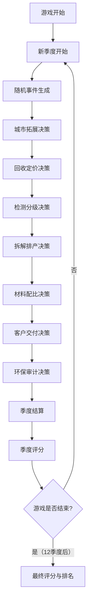

## 1. 产品概述

新能源电池回收再制造供应链策略桌面游戏——玩家经营一家新能源电池回收再制造公司，在多个城市布局回收站点、制定回收定价、安排检测分级与拆解排产、管理镍钴锂关键材料库存、签订储能厂客户订单并完成交付，同时应对环保审计、价格波动、运输限制等随机事件，以季度评分衡量经营表现。

- 目标用户：供应链管理爱好者、策略游戏玩家、新能源行业从业者
- 核心价值：通过沉浸式模拟体验，理解新能源电池回收产业链的关键决策节点与风险博弈

## 2. 核心功能

### 2.1 用户角色

| 角色 | 说明 |
|------|------|
| 玩家（CEO） | 全权经营电池回收再制造公司，做出所有战略与运营决策 |

### 2.2 功能模块

1. **总览仪表盘**：核心指标概览（现金流、碳减排、交付率、库存风险、声誉等级）、当前季度/回合信息、事件通知
2. **城市拓展**：中国城市地图、回收站点选择与建设、运输路线规划
3. **回收定价**：各城市补贴价格调整、回收量预测、回收成本分析
4. **检测分级**：检测线排班、电池批次检测、梯次利用/拆解分流
5. **拆解排产**：拆解产线管理、产能分配、排产计划
6. **材料配比**：镍/钴/锂库存管理、材料配比方案、采购补充
7. **客户交付**：客户订单管理、产能分配、运输调度、催单处理
8. **环保审计**：碳排放追踪、污染事件处理、合规评分
9. **季度评分**：多维度评分（财务、环保、客户满意度、运营效率）、排名对比、历史趋势

### 2.3 页面详情

| 页面名称 | 模块名称 | 功能描述 |
|----------|----------|----------|
| 总览仪表盘 | 核心指标卡 | 显示现金流、碳减排量、交付率、库存风险指数、声誉等级 |
| 总览仪表盘 | 事件通知栏 | 显示当前回合随机事件（价格波动、污染警告、客户催单、运输中断） |
| 总览仪表盘 | 迷你趋势图 | 关键指标历史走势缩略图 |
| 城市拓展 | 城市地图 | 可视化展示已开放/未开放城市，点击选择城市查看详情 |
| 城市拓展 | 站点建设 | 选择城市建立回收站点，显示建设成本与预期回收量 |
| 城市拓展 | 运输路线 | 已建站点间运输线路，显示运力与运费 |
| 回收定价 | 补贴价格面板 | 各城市回收补贴单价滑块/输入框，实时计算回收成本 |
| 回收定价 | 回收量预测 | 基于补贴价格的回收量预测曲线（价格越高回收量越大） |
| 回收定价 | 成本效益分析 | 回收总成本 vs 预期材料价值对比 |
| 检测分级 | 检测线排班 | 拖拽安排检测线工位，分配检测产能 |
| 检测分级 | 批次列表 | 待检测电池批次列表，显示来源、数量、优先级 |
| 检测分级 | 分级结果 | 检测后自动分流：梯次利用批次 / 拆解批次 |
| 拆解排产 | 产线管理 | 拆解产线数量与状态，升级扩产选项 |
| 拆解排产 | 排产计划 | 选择拆解批次安排到产线，设置排产优先级 |
| 拆解排产 | 产能甘特图 | 可视化产线占用与空闲时段 |
| 材料配比 | 库存面板 | 镍/钴/锂当前库存量、安全库存线、预警状态 |
| 材料配比 | 配比方案 | 为客户订单选择材料配比方案，优化成本与质量 |
| 材料配比 | 采购补充 | 紧急采购通道，显示市场价与交货周期 |
| 客户交付 | 订单列表 | 待交付客户订单，显示需求量、交期、罚则 |
| 客户交付 | 产能分配 | 将可用产能/材料分配到各订单 |
| 客户交付 | 运输调度 | 选择运输方式与路线，处理运输限制 |
| 客户交付 | 催单处理 | 客户催单事件，加速生产或支付违约金 |
| 环保审计 | 碳排放追踪 | 各环节碳排放统计，碳减排指标达成进度 |
| 环保审计 | 污染事件 | 随机污染事件卡片，选择处理方案（罚款/整改/停产） |
| 环保审计 | 合规评分 | 环保合规等级与改进建议 |
| 季度评分 | 多维雷达图 | 财务、环保、客户满意度、运营效率四维评分 |
| 季度评分 | 历史趋势 | 各季度评分变化折线图 |
| 季度评分 | 评级总结 | 综合评级（S/A/B/C/D）、关键事件回顾、下季度建议 |

## 3. 核心流程

玩家从第1季度开始经营，每季度包含以下回合流程：
1. **事件阶段**：系统随机生成本季度事件（价格波动、污染警告、运输限制、客户催单）
2. **决策阶段**：玩家依次在8个界面做出决策（城市拓展→回收定价→检测分级→拆解排产→材料配比→客户交付→环保审计）
3. **结算阶段**：系统计算本季度经营结果，更新各项指标
4. **评分阶段**：展示季度评分，玩家可查看详细报告

## 4. 用户界面设计

### 4.1 设计风格

- **主色调**：深墨绿（#0D1F2D）为底色，搭配电光绿（#00FF88）作为强调色，体现新能源与环保主题
- **辅助色**：琥珀金（#F59E0B）用于警告/重要信息，冰蓝（#38BDF8）用于数据/指标，珊瑚红（#EF4444）用于危险/亏损
- **按钮风格**：圆角矩形（rounded-lg），hover 时发光边框效果，主按钮电光绿底色
- **字体**：标题使用 Rajdhani（科技感），正文使用 Noto Sans SC（中文适配）
- **布局风格**：左侧固定导航栏 + 右侧内容区，卡片式模块布局，深色仪表盘风格
- **图标风格**：Lucide 线性图标，电光绿色
- **动效**：卡片入场动画、数字跳动效果、进度条填充动画、事件通知滑入

### 4.2 页面设计概览

| 页面名称 | 模块名称 | UI元素 |
|----------|----------|--------|
| 总览仪表盘 | 核心指标卡 | 5个指标卡横排，深色卡片+发光数字，hover放大 |
| 总览仪表盘 | 事件通知栏 | 右侧滑入式通知，颜色编码（绿/黄/红） |
| 总览仪表盘 | 迷你趋势图 | 折线缩略图，半透明填充 |
| 城市拓展 | 城市地图 | SVG中国地图，已开放城市发光标记，未开放灰色 |
| 城市拓展 | 站点建设 | 弹窗表单，建设费用与预计回收量展示 |
| 回收定价 | 补贴价格面板 | 滑块+数字输入，实时联动回收量曲线 |
| 检测分级 | 检测线排班 | 可视化产线面板，拖拽排班 |
| 拆解排产 | 产能甘特图 | 横向条形甘特图，颜色区分批次状态 |
| 材料配比 | 库存面板 | 3个材料库存进度条，低于安全线变红 |
| 客户交付 | 订单列表 | 卡片式订单，倒计时交期，颜色编码紧急度 |
| 环保审计 | 碳排放追踪 | 环形进度图，各环节占比 |
| 季度评分 | 多维雷达图 | 四维雷达图+综合评级徽章 |

### 4.3 响应式设计

- 桌面优先设计（1920x1080为基准）
- 导航栏在窄屏下收缩为图标模式
- 内容区在平板端自适应为双列，手机端单列滚动

### 4.4 3D场景指引

不涉及3D场景
