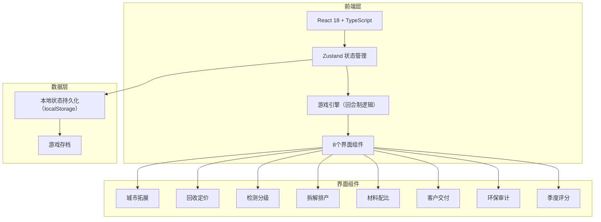
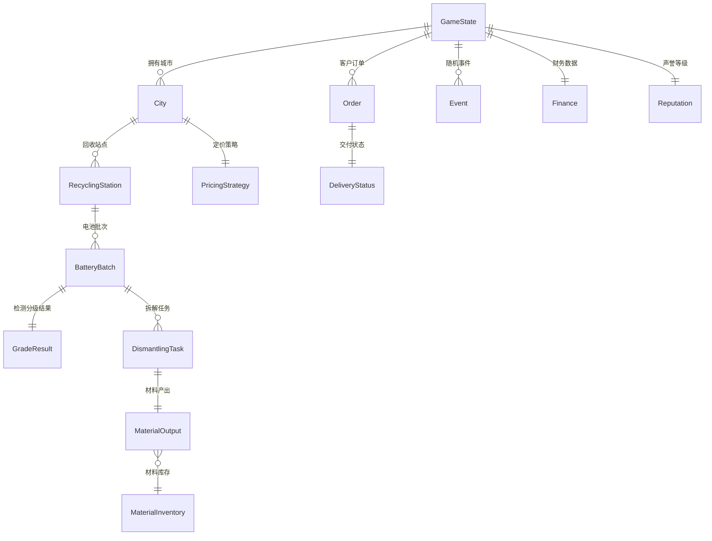

## 1. 架构设计



纯前端架构，所有游戏逻辑在客户端运行，使用 localStorage 进行游戏存档持久化。

## 2. 技术说明

- **前端框架**：React 18 + TypeScript + Vite
- **样式方案**：Tailwind CSS 3
- **状态管理**：Zustand（游戏全局状态）
- **路由**：React Router DOM v6
- **图表**：Recharts（折线图、雷达图、甘特图）
- **图标**：lucide-react
- **后端**：无（纯前端游戏）
- **数据库**：无（Zustand + localStorage 持久化）

## 3. 路由定义

| 路由 | 用途 |
|------|------|
| / | 总览仪表盘 |
| /city | 城市拓展界面 |
| /pricing | 回收定价界面 |
| /inspection | 检测分级界面 |
| /dismantling | 拆解排产界面 |
| /materials | 材料配比界面 |
| /delivery | 客户交付界面 |
| /audit | 环保审计界面 |
| /scoring | 季度评分界面 |

## 4. API定义

无后端API，所有数据通过 Zustand Store 管理。

## 5. 服务端架构图

不涉及服务端。

## 6. 数据模型

### 6.1 数据模型定义



### 6.2 核心数据结构

```typescript
interface GameState {
  quarter: number
  phase: 'event' | 'decision' | 'settle' | 'scoring'
  currentStep: number
  cities: City[]
  orders: Order[]
  events: GameEvent[]
  finance: Finance
  reputation: Reputation
  inventory: MaterialInventory
  productionLines: ProductionLine[]
  inspectionLines: InspectionLine[]
  carbonMetrics: CarbonMetrics
  history: QuarterHistory[]
}

interface City {
  id: string
  name: string
  unlocked: boolean
  unlockCost: number
  stations: RecyclingStation[]
  transportCapacity: number
  transportCost: number
}

interface RecyclingStation {
  id: string
  cityId: string
  level: number
  subsidyPrice: number
  predictedVolume: number
  actualVolume: number
  batches: BatteryBatch[]
}

interface BatteryBatch {
  id: string
  stationId: string
  quantity: number
  status: 'pending' | 'inspecting' | 'graded'
  grade?: 'cascade' | 'dismantle'
  inspectionLineId?: string
}

interface MaterialInventory {
  nickel: number
  cobalt: number
  lithium: number
  nickelSafety: number
  cobaltSafety: number
  lithiumSafety: number
  marketPrices: { nickel: number; cobalt: number; lithium: number }
}

interface Order {
  id: string
  clientName: string
  material: 'nickel' | 'cobalt' | 'lithium' | 'cascade_battery'
  quantity: number
  deadline: number
  price: number
  penalty: number
  status: 'pending' | 'producing' | 'delivering' | 'completed' | 'overdue'
  urgency: number
}

interface GameEvent {
  id: string
  type: 'price_fluctuation' | 'pollution_warning' | 'transport_disruption' | 'customer_urgency'
  description: string
  impact: Record<string, number>
  resolved: boolean
  resolution?: string
}

interface Finance {
  cash: number
  revenue: number
  cost: number
  profit: number
  cashFlow: number[]
}

interface CarbonMetrics {
  totalReduction: number
  quarterlyReduction: number
  targetReduction: number
  pollutionIncidents: number
  complianceScore: number
}

interface Reputation {
  level: 'S' | 'A' | 'B' | 'C' | 'D'
  score: number
  deliveryRate: number
  customerSatisfaction: number
}
```
